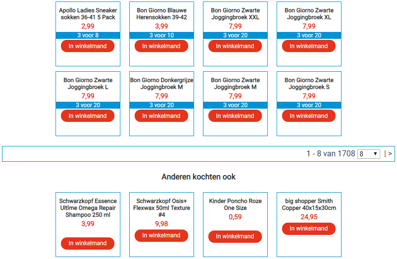

# huwebshop
Git for the HU Webshop project.

## Introduction

This project was created to assist the students of TAAI-V1GP-19 (Group Project) with using the provided database of real-life products, sessions and anonymized profiles. Last year (2018-2019), students were given this same data and asked to create a recommendation service. However, getting the database to a visibly workable state proved to be such a difficult task, that much of the course's runtime was dedicated to that alone. We hope that by removing that roadblock in advance, students can dedicate their time to the actually interesting part of the course.

The project contains the following:

1. **An example webshop**, which can connect to a preconfigured database, either local or remote, and display basic pages such as product listing pages, product detail pages and a rudimentary shopping cart;
2. **A dummy recommendation service**, which uses the same database to provide recommendations through a REST interface, although at the moment, it simply returns randomly chosen products;

In the following sections, we will go into more detail on the requirements for setting up this project on your own device, how to run it, and what it should look like.

The author of this project is Nick Roumimper (nick.roumimper@hu.nl). If there are any questions about this project that this Readme can't answer (which may very well happen), please feel free to contact me.

## Requirements

To run this code, you need to have the following programs and libraries installed:

- **Python 3** (website: https://www.python.org/). This code was developed using Python 3.7. Some of the libraries used here use methods that are set to become deprecated in Python 3.8; when using any version beyond 3.7, be sure to use the most recent versions possible.
- **MongoDB Community Edition** (webpage: https://docs.mongodb.com/manual/administration/install-community/). This allows you to run a MongoDB database locally; almost all students will want to do this. It is strongly advised to also include MongoDB Compass (an option that comes up during the installation wizard).
- **Flask** (command line: <code>pip install Flask</code>). This code was developed using Flask 1.0.3, and automatically included Jinja2 v. 2.10.1 and Werkzeug v. 0.15.4, amongst other things.
- **Pymongo** (command line: <code>pip install pymongo</code>). This code was developed using Pymongo 3.8.0.
- **Flask-RESTful** (command line: <code>pip install flask-restful</code>). This code was developed using Flask Restful 0.3.7. This library allows you to run the dummy recommendation service locally; almost all students will want to do this, at least to start out with.
- **Python-Dotenv** (command line: <code>pip install python-dotenv</code>). This code was developed using Python-Dotenv 0.10.3.
- **Requests** (command line: <code>pip install requests</code>). This code was developed using Requests 2.22.0.

## Sources Included in this Repository

- **jQuery v. 3.4.1**, from https://jquery.com
- **Roboto font files**, Latin and Latin-Extended, downloaded from Google Fonts (https://fonts.google.com)
- **CSS snippets for responsive buttons**, provided by Federico Dossena (https://fdossena.com/?p=html5cool/buttons/i.frag)

## First Run Instructions

In order to get this project to run, the following steps need to be completed:

1. Set up the database, either locally or remotely;
2. Configure the environment variables for the local webshop and recommendation service;
3. Start up the recommendation service;
4. Start up the webshop.

We will expand upon the process for each of these steps in the upcoming subsections.

### Database Setup

The course's teacher is expected to have provided you with the files that make up the database at this point. Note that these are not included in this project, due to their size. Alternatively, you have received credentials for a remote MongoDB cluster to connect to. If neither apply, please contact your course's teacher.

Please follow the instructions in the subsection applicable to your situation.

#### Setting Up a Local Database

You are expected to have three files in your possession:

1. products.json, containing the full set of products available in the webshop;
2. sessions.json (sometimes called sessions4.json), containing all applicable sessions for our subset of the data;
3. profiles.json (sometimes called visitors.json), containing the profiles associated with the sessions.

With MongoDB Community Edition installed on your device, ideally including MongoDB Compass, take the following steps:

- **Create a database called <code>huwebshop</code>** (alongside the default ones: admin/config/local). In MongoDB Compass, you see this option after connecting to your local database with default settings; if asked for the name of a collection, call it "products". When using the Mongo Daemon, a command such as "use huwebshop" may be required.
- **Make sure you can access the mongoimport tool** from the folder containing your data. On most computers, that means adding the path to the folder containing the executables (typically something like <code>C:\Program Files\MongoDB\Server\4.2\bin</code>) to your PATH environment variable. If that doesn't work, or you're working off of misbehaving HU employee laptops like us, you can also navigate to this same folder, copy the executable and paste it alongside the three files (yuck).
- **Import products.json to a collection called <code>products</code>.** A mongoimport command is structured like this:
    
    <code>mongoimport --db *database name* --collection *collection name* --file *file name* --legacy</code>

    The legacy flag is required when using mongoimport version 4.2 or beyond, because the files are in the old Extended JSON format (v1). Anyone who has recently installed mongoimport will have a version of 4.2 or beyond; if you have an older version (command line: <code>mongoimport --version</code>), consider leaving off the legacy flag. 

    So in this particular case, you would have to execute the following from the command prompt:

    <code>mongoimport --db huwebshop --collection products --file products.json --legacy</code>
- **Import sessions.json/sessions4.json to a collection called <code>sessions</code>.** In other words, execute the mongoimport command:

    <code>mongoimport --db huwebshop --collection sessions --file sessions.json --legacy</code>

    with a different filename, if necessary.
- **Import profiles.json/visitors.json to a collection called <code>profiles</code>.** In other words, execute the mongoimport command:

    <code>mongoimport --db huwebshop --collection profiles --file profiles.json --legacy</code>

    with a different filename, if necessary.

And that should do it! You now have a database running on your local system with all three collections necessary to feed both your webshop instance and your recommendation engine.

#### Connecting to a Remote Database

You are expected to have received credentials for a remote MongoDB database cluster, which can be explored in your browser by signing in at https://www.mongodb.com. If you have these credentials, we'll assume you got them from your teacher, and you don't have to set up the collections anymore. This section is primarily dedicated to ensuring that eventually connecting goes smoothly.

Be sure to check the following when you try connecting for the first time:

- **Are you on the network whitelist?** Unless explicitly configured to allow everyone, MongoDB clusters are set to only accept connections from preset IP addresses. Check under Security > Network Access in the web interface to see which applies to you.
- **Do you have both read and write rights?** Although this webshop code will not change the preexisting data, it may attempt to add a collection called <code>categoryindex</code> if it does not yet exist. Check exactly which rights you have under Security > Database Access in the web interface.
- **Do you know the cluster's server name?** You presumably have a username and a password, but do you also have the last missing piece, the cluster's server name? This slightly odd identifier is also needed to connect to this cluster. It can be found by navigating to Clusters > Command Line Tools > Connect Instructions > Choose a Connection Method > Connect Your Application, and examining the field under "Connection String Only". This should be in the format of:

    <code>mongodb+srv://{username}:{password}@{server name}/test?retryWrites=true&w=majority</code>

    As you may have guessed, the server name we're referring to is the section between the at sign and the forward slash. If you don't have this, write this down and keep it handy!

### Configure the Environment Variables

In order to make running the code easier after it has been set up the first time, we have moved certain settings to a .env file. You will need such a file in the top-level directory of this repository if either of the following two applies:

1. You wish to connect to a remote MongoDB cluster;
2. You wish to connect to a recommendation service that is not at the default location (which here is http://127.0.0.1:5001). 

If you are trying to connect to your local MongoDB, using the default dummy recommendation service, you don't need to perform this step.

To set this up easily from a Unix shell (which includes the Git Bash included with most distributions of Git), you can run huw_remote_setup.sh (command line: <code>sh huw_remote_setup.sh</code>). However, at its core, the .env file is just a text file containing four variables:

    MONGODBSERVER=*server name for the remote MongoDB cluster*
    MONGODBUSER=*user name for the remote MongoDB cluster*
    MONGODBPASSWORD=*password for the remote MongoDB cluster*
    RECOMADDRESS=*address for the recommendation service*

Any variables you're not using, you can leave blank (e.g. <code>MONGODBSERVER=</code>).
Note that the file must be called exactly <code>.env</code>. So technically, the file doesn't have a name, it only has an extension. 

### Start the Recommendation Service

To run the recommendation service, you will need to open a terminal window and navigate to the top-level directory of this repository. If you have a Unix shell handy, you can run huw_recommend.sh (command line: <code>sh huw_recommend.sh</code>). If not, you need to perform the following commands (written for Windows, Command Prompt specifically):

    set FLASK_APP=huw_recommend.py
    python -m flask run --port 5001

Depending on your system and type of terminal, these commands may need to be slightly different. Refer to the Flask Quickstart for more information on these commands.

You will know if/when the code is running when its terminal shows the following message:

    * Running on http://127.0.0.1:5001/ (Press CTRL+C to quit)

If this code runs, you can't see it do anything yet. Just be sure to leave this terminal window open!

### Start the Webshop

Now, let's run the webshop! You will need to open **another, separate terminal window** and navigate to the top-level directory of this repository. If you have a Unix shell handy, you can run huw.sh (command line: <code>sh huw.sh</code>). If not, you need to perform the following commands (written for Windows, Command Prompt specifically):

    set FLASK_APP=huw.py
    python -m flask run

When you run this program for the first time, it may take a while to start up. It should be faster on future iterations. You will know if/when the code is running when its terminal shows the following message:

    * Running on http://127.0.0.1:5000/ (Press CTRL+C to quit)

While both terminal windows are running, go to your browser of choice and navigate to <code>http://127.0.0.1:5000</code> (the default location and port for Flask projects). If you see a front page like the one shown below, congratulations! This environment is your test webshop for the Group Project.

### Stopping Either Process

When you're done with this particular session, or you want to stop and restart either service because you've made changes, you can terminate the process by going into the appropriate terminal window and pressing, as suggested, CTRL+C.

## The Project in Action

When running, the front page of the webshop should look something like this:

The text may be different in future versions, but the overall layout should remain more or less the same. The bar at the top allows you to change the profile ID you're viewing the site with; it defaults upon restart to the first one it can find. In the database, you will find these IDs in the profiles table, as the \_id property, e.g. ObjectId("5a3a1169a825610001bc0f3a") . This allows you to test your recommendation engine with different profiles.

Through the main menu, you can reach the product overview and detail pages. You can tell the recommendation service is working when refreshing the page leads to entirely different random suggestions:

---

---

...and then, after refreshing...

---

---

Feel free to play around and test this webshop (or rather, a shell of a webshop) out! If you run into any errors, or have ideas for improvements that aren't yet listed in this Readme, feel free to contact the author at nick.roumimper@hu.nl.

## Design Philosophy

If you're going to change parts of this code, it may be helpful to understand the design philosophy behind it. Much of this section goes into the webshop part, seeing as that is the most complex element. You can also review this section if you're interested as to how the project is structured.

- **The recommendation service is as simple as possible.** It is a REST service with one GET method, that takes the profile id and number of recommendations as parameters and returns that number of random products from the database. In fact, it doesn't even use the profile id - this is only to demonstrate how parameters are passed to the service. This is what you'll want to expand on and get creative with.
- **The project uses default directories for its content.** The Flask default setup stores any static resources (CSS, Javascript, images) in the <code>static</code> folder, and any HTML templates in the <code>templates</code> folder.
- **The default session mechanism in Flask is used to store user data.** Flask maintains a session mechanism that encrypts its cookies given a special secret key; here, the secret key is randomly generated whenever the webshop is started. In the session object, we store the profile id, shopping cart, number of items per page and so on.
- **The Python code for the webshop does not render HTML.** Since Jinja, the templating engine behind Flask, can process all kinds of complex objects, the Python code's role is essentially to retrieve the necessary data and pass it along. This also means that the .html files in the templates folder contain a lot of interesting logic.
- **The Python code uses the add_url_rule method instead of decorators.** If you're used to working with Flask, you may expect to see the @app.route() decorator around. However, we've attempted to keep as much logic as possible inside the single class of this project. You can find the equivalent add_url_rule function calls in the \_\_init\_\_ of huw.py.
- **Dynamic Javascript requests are handled through POST calls.** Several events stemming from the webshop occur "in-page", i.e. without navigating to a different URL. To distinguish between these requests and regular, viewable pages, we have restricted the associated functions to POST calls. You can find these methods at the bottom of the class.
- **The Jinja templates extend the base template (base.html).** For a webshop this simple, we can use one general template for almost all pages, only changing the center div's content for each page - so that is what we did.

Thank you for working with this project! We hope it helps to have this base setup at your disposal.

## Todo (Reference for the Developers)

- [ ] Design improvements and tweaks (closer to the real thing)
  - [ ] Product page layout improvements
  - [ ] Stylize the dynamic shopping cart element
- [ ] Optional improvements
  - [ ] Extend documentation to non-Windows systems
  - [ ] Create shell scripts for all systems
  - [ ] Packaging?
  - [ ] Sorted category index
  - [ ] Correct pagination redirects
  - [ ] Error pages
  - [ ] Image generator
  - [ ] Search function
  - [ ] Offset and page relocation pagination
  - [ ] Responsive design
  - [ ] Price calculation and discount rule implementation

<!--

## Notes On The Project

When testing this project, the following issues arose when trying to work with the full dataset provided:

- The MongoDB Community Edition program, which runs the database service locally, had significant trouble with importing large files on my device.
    - While returning an error ("Unexpected end of JSON file"), it ceased after importing between 10k and 20k documents.
    - The documents that were indeed imported were received correctly, but they were far fewer in number than was to be expected. 
    - When trying the import process multiple times, it failed each time with the same error - but every time with a different number of documents reached. This shows that the error is not in the JSON, regardless of what MongoDB might say.
    - If students were to use local instances of the datasets and unexpectedly get completely different databases as a result, the risk of confusion and subpar products would be massive.
- The MongoDB Free Tier Cloud Cluster, which is provided by MongoDB directly, ran into the limits of its Free Tier when trying to handle the full dataset.
    - The Free Tier allows for 512 MB of storage; the full dataset is approximately 16 GB in size.
    - The cheapest option MongoDB provides that loads the full dataset (M10 Dedicated Cluster, with 20 GB of storage) costs $0,10/hr to run.
    - The cost of setting up such a cluster for the duration of the course (10 weeks) would be 10 * 7 * 24 * $0,10 = $168,- = approx. €150,-.
    - For development and testing purposes, and without agreed-upon compensation, this is fairly costly to run for the employees developing the website - and without a doubt unaffordable for our students individually.

It deserves the consideration of the Hogeschool to pay for a centrally hosted Cloud cluster when this course is actually taught; this Cluster can then be hailed from both the running example website, and the recommendation engines working with the data, functioning as a single source of truth. However, in the meantime, this repository will be updated to contain a testing subset of all data. This data will be constructed separately, once, based on the following criteria:

- A random selection of visitors (i.e. profiles), < 100 MB in size, that are known to have at least one associated existing session.
- The subset of sessions associated with the visitors selected, <= 100 MB in size.
- The file containing all products, which is 357 MB in size.

These restrictions are inspired by the following aspects:

- When compressing the products file in a .zip archive, all of the files can also be included in the Github repository for this project, collecting all necessary data in one place;
- If the products subset remains its original size, the total size of all files is very likely to remain within the MongoDB Free Tier Cluster range (512 MB).

The first testing subset has been composed according to the following additional requirements:

- Based on a back-of-the-envelope estimation of the number of sessions that fit into 100 MB, we find that about 21606 sessions can fit into the file.
- Out of these, we want 15000 of the sessions to have been added by frequent users - i.e. users that have 10 or more sessions attributed to one of their browser configurations. This assures that the sample set contains profiles with "heavy" parameters to test on.
- The remaining 6606, we want to fill with infrequent users - i.e. browser configurations that have 3 or fewer sessions attributed to them. (Note that since one user may have multiple browser configurations, the user itself may still be frequent, but given the general sparseness of the data, this is presumed to be sufficiently unlikely.) This assures that the sample set contains profiles with "light" parameters to test on.

This first testing subset can now be found in the folder datasets_sample_1/.

## Development Questions

- How can I autodeploy my script to the cloud?
	- Through a fairly complicated shell script, but there is a draft version of the pre-project packaging version in the helloworld folder of the project.
- How does the database operate when I run it on my local machine?
	- Fine, actually, and fairly quickly too.
- How can I package my code such that I can easily push it to the App Engine - or any other platform?
	- Command line variables that allow you to specify where the database/collection is you are trying to connect to, a YAML file to provide the configuration, a requirements.txt to automate getting the libraries through pip and a shell script to execute the deployment automatically from the cloud shell. But this, at the moment, is not yet required.
- Can the shop actually be crawled for images?
	- Not since the 18th of June, it can't. The site appears to have been locked behind a rudimentary login prompt.
- How can I use dynamic and optional attributes in the URLs?
	- To retrieve GET parameters, you can use an import (from flask import request) and its subsequent object request.args.get("parameter name") to get the value. You can also use dynamic values in the URLs themselves 
- How can I generate a random "shopper name" from a session ID?
	- No need to use the session ID; Flask automatically supports maintaining a session that allows you to store any amount of data.
- What would be the most sensible place to store the shopping cart information for any given user?
	- In the session object.
- How can I get templates to work within this structure?
	- Damn near instantly, using the render_template function as well as referring directly to the session object from there.
- How can I get one function to execute before every route?
	- By using the @app.before_request decorator.
- How can I handle errors (such as 404s) in this application?
	- Redirect users to different endpoint with redirect(url_for), abort with an error code with abort(404) (or another numeric code), and use the @app.errorhandler(404) decorator (or another code) to handle errors.
- How can I recursively refer to templates from within templates? Or does this need to happen on the code level?
	- Templates can be extended, which allow the replacement of certain blocks; there's an example of this now in the code folder. Recursively, it makes more sense to just use for functions found in Jinja.
- How can I escape the HTML used, preferably automatically?
	- This is already done automatically by Flask in the render_template function.
- How would I store an item in the shopping cart, if changing the shopping cart requires sending a request to the server?
	- A basic URL-based method definitely works, without much of a hitch. But I don't think this is reflective of current web standards. An AJAX approach would be more appropriate - at which point, jQuery is the next logical move. To be further developed, once the templates are setup in a logical way in the project proper.

-->
