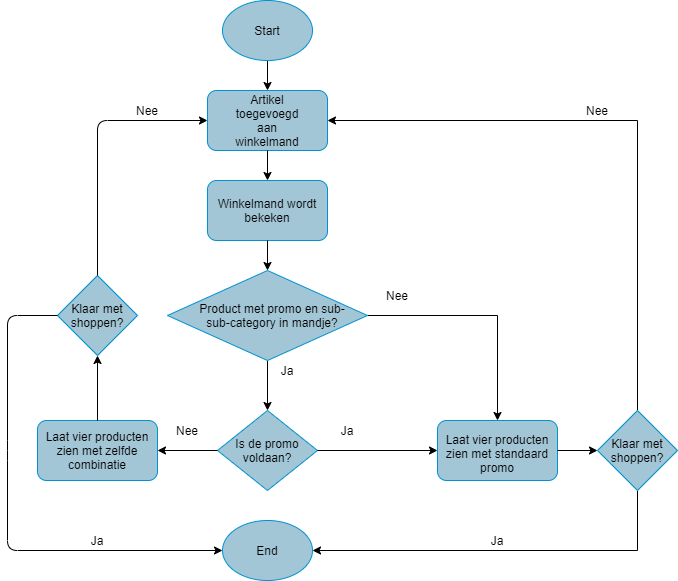
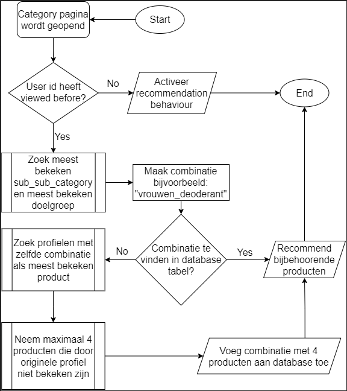

# Project Voorbeeldshop
In dit project wordt een recommendation engine opgezet door het team voor de website van de "Voorbeeldshop".
Deze recommendations worden aan de hand van een heuristiek opgesteld.

## Recommendations:
* Simple recommendation
* Sub sub category en prijsklasse
* Aanbiedingen / promo's
* Anderen bekeken ook
* Personal

### [Simpel](recom_functions/recom_simple_popular.py) recommendation heuristiek:
De vier best verkochte producten met uitzondering van producten die 0 euro kosten.

### [Similar](recom_functions/recom_price_range.py) recommendation:
Vier producten worden aanbevolen op basis van dezelfde prijsklasse als het huidige product en de huidige sub sub category.

### [Simpele Combination](recom_functions/recom_aanbiedingen_4_1.py) recommendation:
De simpele combination is gebaseerd op 4 producten die een promo hebben.

### [Complicated combination](recom_functions/recom_aanbiedingen_4_2.py) recommendation:
De aanbeveling “combination” is gebaseerd op producten in de aanbieding die zich bevinden in dezelfde sub-sub-category. Deze recommendation wordt weergegeven in de winkelmand.

### [Personal deel 1](recom_functions/recom_personal.py) recommendation:
Het algoritme werkt op basis van viewed before.
Er worden dus aanbevelingen gedaan op basis van iemands kijk gedrag.

### [Personal deel 2](recom_functions/recom_behaviour.py) recommendation:
De aanbeveling werkt op basis van iemands persona. 
Er wordt hier gekeken naar segment in combinatie met previously recommended, viewed before en similars.
